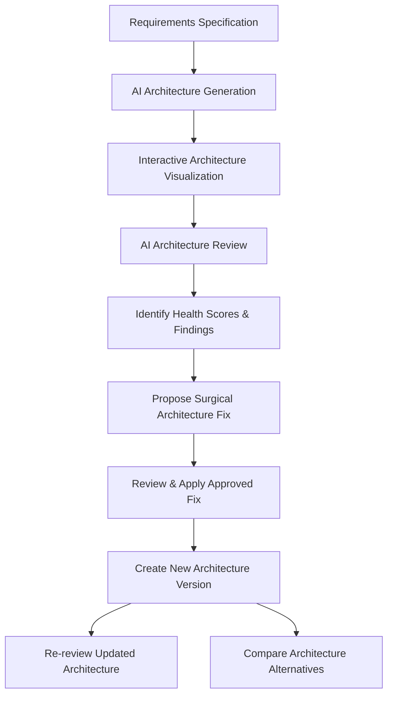

# ArchitectAI

An AI-powered software architecture design and review platform that transforms natural-language requirements into visual, analyzable, and iteratively improvable system architectures.

---

## Overview

Designing software systems requires balancing competing non-functional requirements, identifying single points of failure, selecting appropriate databases and communication protocols, and evaluating complex trade-offs before writing code. 

**ArchitectAI** provides an interactive decision-support workbench for software engineers and architects. Users express application requirements, expected scale, target availability, cloud preferences, and budget constraints in natural language. Powered by Google Gemini, the platform analyzes the specifications to:
- Synthesize an end-to-end software architecture model
- Generate interactive visual topology and dependency diagrams
- Perform adversarial architectural health reviews across key engineering dimensions
- Propose surgical, contextual remediations for architectural vulnerabilities
- Apply approved fixes directly to the underlying architecture model
- Maintain versioned architecture snapshots with complete change histories
- Compare competing architectural paradigms (e.g., Modular Monolith vs. Event-Driven Microservices)

> **Note:** ArchitectAI is an **architecture decision-support tool**, designed to augment engineering judgment and accelerate system design discussions. It is not an autonomous replacement for software architects or engineering teams.

---

## Key Features

- **Natural-Language Requirements Input**: Specify project goals, scale, SLA targets, cloud provider preferences, and operational constraints with optional domain templates.
- **AI-Powered Architecture Generation**: Produces end-to-end technical blueprints, including component breakdowns, database strategies, caching topologies, API contracts, and security controls.
- **Dynamic Architecture Visualization**: Interactive diagrams displaying tiers, components, communication paths, and service dependencies rendered directly from the architecture data model.
- **Dedicated Analytical Views**:
  - **Overview**: Executive summary, architecture style, system capabilities, and estimated monthly cost range.
  - **Requirements**: Functional and non-functional requirements with priority levels and acceptance criteria.
  - **Architecture**: Architectural decisions (ADRs), patterns, and structural rationale.
  - **Services**: Service boundaries, responsibilities, protocols, scaling policies, and dependencies.
  - **Database**: Primary stores, read replicas, cache tiers, indexing strategies, and data models.
  - **APIs**: REST/GraphQL/gRPC endpoints, request/response models, rate limiting, and auth requirements.
  - **Security**: Authentication, authorization (RBAC/ABAC), data encryption (in-transit/at-rest), and compliance notes.
  - **Scalability**: Horizontal/vertical scaling strategies, bottlenecks, caching policies, and traffic surge handling.
  - **Risks & Trade-offs**: Technical debt, single points of failure, and operational challenges.
- **AI Architecture Review & Health Scoring**: Comprehensive audit calculating an overall health score (0–100) and sub-scores across key engineering pillars.
- **Severity-Based Findings**: Categorized findings classified as Critical, High, Medium, Low, or Good Practice.
- **AI-Proposed Architecture Fixes**: Context-aware proposals detailing current architecture, proposed remediation, rationale, expected benefits, and newly introduced trade-offs.
- **In-Place Fix Application**: Applies approved remediations directly to the active architecture model, updating components, database tiers, and diagrams.
- **Architecture Versioning**: Automatic version incrementing ($v1 \rightarrow v2 \rightarrow v3$) upon applying fixes.
- **Re-Review Workflow**: Re-audits updated architecture versions against original requirements while recognizing previously applied fixes.
- **Architecture Comparison**: Side-by-side evaluation of two viable architectural styles for the same requirements across multiple technical and operational metrics.
- **Project History**: Versioned snapshots allowing engineers to inspect, restore, and compare previous architectural iterations.

---

## How It Works



### Workflow Stages:
1. **Requirements Specification**: The engineer enters the application description, user traffic scale, target availability SLA, preferred cloud provider, and budget constraints.
2. **Architecture Generation**: Gemini synthesizes a cohesive architecture model matching the requirements and constraints.
3. **Architecture Visualization**: The system converts the architecture data model into visual component diagrams and pipeline flows.
4. **AI Architecture Review**: The platform conducts an adversarial peer review evaluating potential bottlenecks, resilience vulnerabilities, and operational risks.
5. **Identify Findings**: Review findings are grouped by category and prioritized by severity.
6. **Propose Fix**: The engineer requests an AI-assisted fix proposal for a specific finding. The proposal defines minimal, pragmatic changes rather than unnecessary over-engineering.
7. **Apply Approved Fix**: Upon human review and approval, the change is applied to the architecture specification.
8. **New Architecture Version**: The authoritative architecture version increments, preserving the prior version in the project history.
9. **Re-Review**: The engineer re-runs the review against the newly updated architecture to confirm resolution and assess new trade-offs.
10. **Compare Alternatives**: The engineer can compare competing paradigms to validate architectural decisions against business and team constraints.

---

## Architecture Review

The architecture review evaluates the system against six core dimensions:

| Review Dimension | Focus Area |
| :--- | :--- |
| **Scalability** | Capacity to absorb traffic spikes, horizontal scaling limits, bottleneck mitigation |
| **Availability** | Fault tolerance, multi-AZ deployment, failover mechanisms, SLA alignment |
| **Performance** | Latency, throughput, network hops, caching strategy, database query efficiency |
| **Security** | Identity and access management, encryption, attack surface reduction, threat mitigation |
| **Reliability** | Redundancy, circuit breakers, recovery time objectives (RTO/RPO), data loss prevention |
| **Cost Efficiency** | Infrastructure spending alignment with budget, idle resource minimization, tier sizing |

### Severity Classifications:
- **CRITICAL**: Immediate operational, data loss, or system outage risk that must be addressed before deployment.
- **HIGH**: Significant resilience, security, or scalability gap that will degrade system quality under load.
- **MEDIUM**: Suboptimal design pattern or performance concern under specific operating conditions.
- **LOW**: Minor optimization opportunity or operational enhancement.
- **GOOD PRACTICE**: Commendable design decision adhering to established engineering best practices.

Every finding provides:
1. **Problem Statement**: Precise description of the architectural vulnerability or gap.
2. **Why It Matters**: Concrete consequences on system availability, security, latency, or business metrics.
3. **Recommended Improvement**: Actionable remediation guidance.

---

## Architecture Remediation

ArchitectAI implements an iterative, closed-loop remediation workflow:

```
[Review Finding Identified]
            ↓
[Request AI-Proposed Fix]
            ↓
[Review Proposed Changes & Trade-offs]
            ↓
[Apply Approved Fix]
            ↓
[Architecture v1 → Architecture v2]
            ↓
[Re-run Architecture Review]
```

1. **Review the Architecture**: Run the automated health review to surface design risks.
2. **Select a Finding**: Choose a finding to address (e.g., single point of failure in primary relational database).
3. **Generate Fix Proposal**: The AI generates a proposal containing:
   - Root cause analysis
   - Current architecture state
   - Targeted modification (e.g., adding read replicas, connection pooling, and multi-AZ automated failover)
   - Quantified architectural benefits
   - Newly introduced trade-offs (e.g., replication lag, licensing cost)
   - Affected system components
4. **Human Review**: The engineer evaluates the proposed change to verify it fits organizational constraints.
5. **Apply Fix**: Applying the fix updates the live architecture state, adjusting service dependencies, database configs, and visual diagrams.
6. **Version Increment**: The architecture version increments (e.g., Version 1 $\rightarrow$ Version 2), recording an entry in the change history.
7. **Re-Review**: Running a new review audits the updated architecture, acknowledging the applied changes and verifying that resolved issues are no longer flagged.

---

## Architecture Comparison

When evaluating system designs, no single pattern is universally optimal. ArchitectAI provides side-by-side trade-off comparisons between alternative architectures for identical requirements.

```
                      [Requirements]
                            │
            ┌───────────────┴───────────────┐
            ▼                               ▼
    Option A: Modular Monolith      Option B: Microservices
            │                               │
            └───────────────┬───────────────┘
                            ▼
              [Multi-Factor Comparison Matrix]
```

### Evaluated Comparison Metrics:
- **Scalability** (1–10)
- **Availability** (1–10)
- **Performance** (1–10)
- **Security** (1–10)
- **Development Complexity** (1–10)
- **Operational Complexity** (1–10)
- **Maintainability** (1–10)
- **Cost Efficiency** (1–10)

In addition to metric scoring, the comparison evaluates:
- Team size and experience alignment
- Time-to-market constraints
- Infrastructure and maintenance budget
- "When to choose Option A" vs. "When to choose Option B"
- Pragmatic architecture recommendations without dogmatic bias toward microservices or distributed systems

---

## Architecture Visualization

ArchitectAI generates interactive visual topologies derived dynamically from the current architecture data model:

- **Tiers & Boundaries**: Clients, edge proxies/CDNs, API gateways, application services, messaging queues, and data stores.
- **Component Metadata**: Responsibilities, technology choices, scaling models, and communication protocols (HTTP, gRPC, WebSocket, AMQP).
- **Dependency Paths**: Directed relationships showing sync/async request and event flows.
- **Dynamic Synchronization**: Any change applied through an architectural fix updates the visual diagram to reflect the new state.

---

## Project History and Versioning

Architectural decisions evolve over time. ArchitectAI maintains an authoritative version trail for every project:

```
Architecture v1 (Initial Generation)
       ↓
  AI Review (Health Score: 78/100, 2 High Findings)
       ↓
  Fix Applied (Added Redis Cache & Read Replicas)
       ↓
Architecture v2 (Updated State)
       ↓
  AI Re-Review (Health Score: 92/100, Findings Resolved)
```

- **Immutable Version Snapshots**: Each version captures the full state (services, database, APIs, security, and diagram).
- **Restoration & Inspection**: Engineers can roll back to previous versions or inspect historical revisions.
- **Audit Log**: Tracks the exact finding and proposal that prompted each version increment.

---

## Example Use Cases

- **E-Commerce Platforms**: Designing payment processing gateways, inventory reservation services, and checkout flows with strong transactional consistency and high-availability SLAs.
- **Video Streaming Platforms**: Architecting CDN distribution, video ingestion, transcoding pipelines, metadata caching, and low-latency playback APIs.
- **IoT & Telemetry Platforms**: Modeling high-throughput ingestion brokers (MQTT/Kafka), time-series storage, stream processing, and cold-tier data lakes.
- **B2B SaaS Applications**: Designing multi-tenant architectures, tenant data isolation, role-based access control, SSO, and audit logging.
- **High-Scale Web Applications**: Structuring edge caching, distributed database read replicas, connection pooling, and circuit breaker patterns.
- **Enterprise Systems**: Designing migration roadmaps from legacy monoliths to modular services with enterprise security and governance.

---

## AI Architecture

ArchitectAI integrates Google Gemini models via the official `@google/genai` TypeScript SDK:

- **Structured Output Schemas**: All architecture specifications, review audits, fix proposals, and comparisons utilize strict JSON schemas (`responseSchema` and `responseMimeType: 'application/json'`). This guarantees structured, machine-parsable responses that populate the application state and visualization engines without regex extraction hacks.
- **Prompt Engineering & System Personas**: Queries are framed from the perspective of a Senior Principal Software Architect, enforcing pragmatic, requirement-grounded advice rather than generic recommendations.
- **Resilient Retry Handling**: Includes exponential backoff, rate-limit awareness, and fallback model resolution (`gemini-3.8-flash`, `gemini-flash-latest`, `gemini-3.1-flash-lite`).
- **Context Preservation**: Remediation and re-review prompts pass the current architecture state, requirements, and applied fix history to ensure the AI evaluates current reality rather than original stale drafts.

---

## Design Principles

- **Requirement-Driven Architecture**: Technical decisions must trace back to stated scale, budget, SLA, and business requirements.
- **Structured AI Output**: Enforce schema constraints on all model responses to ensure UI reliability and data model integrity.
- **Explainable Recommendations**: Every finding and proposal must explain *why* it matters and what trade-offs it introduces.
- **Human Approval**: AI proposes; the engineer approves. No architectural mutations occur without explicit human consent.
- **Iterative Improvement**: Architecture is treated as an evolving document refined through review, fix, and verification cycles.
- **Pragmatic Trade-Off Analysis**: Simple architectures are preferred when requirements do not justify distributed system overhead.

---

## Technology Stack

The project relies strictly on the following technologies:

### Backend & Server
- **Node.js** & **TypeScript**
- **Express 4**: HTTP API server hosting architecture generation, review, fix, and comparison endpoints
- **tsx**: TypeScript runtime for development execution
- **dotenv**: Environment variable configuration

### AI Integration
- **@google/genai**: Official Google GenAI TypeScript SDK (Gemini models)

### Frontend & UI
- **React 19**: Component architecture and state management
- **Vite 8**: Frontend tooling and dev server integration
- **Tailwind CSS v4**: Utility-first responsive styling
- **Lucide React**: Engineering and architecture iconography
- **Motion (`motion`)**: Interface animations and modal transitions

---

## Project Structure

```
├── .env.example                         # Environment variable template
├── index.html                           # Single-page application entry point
├── metadata.json                        # Applet metadata configuration
├── package.json                         # Project dependencies and scripts
├── server.ts                            # Express API server & Gemini integration
├── tsconfig.json                        # TypeScript compiler configuration
├── vite.config.ts                       # Vite build configuration
└── src/
    ├── main.tsx                         # React entry point
    ├── App.tsx                          # Primary application controller & state
    ├── index.css                        # Global Tailwind styles
    ├── components/                      # UI components
    │   ├── AboutModal.tsx               # Product overview and documentation modal
    │   ├── ArchitectureChangeHistoryModal.tsx # Version history & changelog modal
    │   ├── ArchitectureFixModal.tsx     # Fix proposal review & confirmation modal
    │   ├── ArchitectureForm.tsx         # Requirements specification input form
    │   ├── ArchitectureTopology.tsx     # Topology layout and container
    │   ├── ExportReportModal.tsx        # Architecture specification export modal
    │   ├── HistoryDrawer.tsx            # Project history and version selector drawer
    │   ├── MainDashboard.tsx            # Project summary dashboard
    │   ├── RequirementsView.tsx         # Structured requirements inspector
    │   ├── VisualArchitectureDiagram.tsx # Dynamic architecture diagram renderer
    │   └── tabs/                        # Modular architecture detail tabs
    │       ├── ApisTab.tsx              # API endpoints, protocols, and payloads
    │       ├── ArchitectureReviewTab.tsx # Review findings, scores, and fix triggers
    │       ├── CompareTab.tsx           # Multi-option architecture comparison view
    │       ├── DatabaseTab.tsx          # Database, replica, and cache topology
    │       ├── OverviewTab.tsx          # Executive overview and ADR summary
    │       ├── RisksTradeoffsTab.tsx    # Technical risks, debt, and trade-offs
    │       ├── ScalabilityTab.tsx       # Scaling policies and bottlenecks
    │       ├── SecurityTab.tsx          # Auth, encryption, and threat model
    │       └── ServicesTab.tsx          # Microservices/modules and boundaries
    ├── data/
    │   └── sampleTemplates.ts           # Pre-configured domain requirement templates
    ├── services/
    │   └── architectureApi.ts           # Typed client service for backend endpoints
    ├── types/
    │   └── architecture.ts              # Core TypeScript interfaces and data models
    └── utils/
        ├── diagramBuilder.ts            # Visual diagram layout and node generation
        └── exportUtils.ts               # Markdown and JSON export formatters
```

---

## Getting Started

### Prerequisites
- **Node.js** (v18.x or higher, v20+ recommended)
- **npm** (v9.x or higher)
- **Google Gemini API Key**: Obtainable from [Google AI Studio](https://aistudio.google.com/)

### Installation & Setup

1. **Clone the repository**:
   ```bash
   git clone https://github.com/your-username/ArchitectAI.git
   cd ArchitectAI
   ```

2. **Install dependencies**:
   ```bash
   npm install
   ```

3. **Configure environment variables**:
   Create a `.env` file in the project root based on `.env.example`:
   ```bash
   cp .env.example .env
   ```
   Open `.env` and set your Gemini API key:
   ```env
   GEMINI_API_KEY="your_actual_gemini_api_key_here"
   ```

4. **Start the development server**:
   ```bash
   npm run dev
   ```
   The application will start on `http://localhost:3000`.

5. **Type check and build**:
   ```bash
   # Run TypeScript type check
   npm run lint

   # Build frontend assets for production
   npm run build

   # Start production server
   npm start
   ```

---

## Screenshots

> *Screenshots illustrating key workflows:*

| Architecture Generation & Visualization | AI Architecture Review & Health Audit |
| :---: | :---: |
|  |  |

| Remediation Proposal & Fix Application | Architectural Paradigm Comparison |
| :---: | :---: |
|  |  |

---

## Future Improvements

*The following capabilities are potential roadmap items and are **not currently implemented**:*

- **Infrastructure-as-Code (IaC) Generation**: Automated generation of Terraform, OpenTofu, AWS CDK, or Kubernetes YAML manifests directly from the architecture model.
- **Real-Time Cloud Cost Estimation**: Live pricing queries against AWS, Azure, and GCP pricing APIs for precise monthly infrastructure cost models.
- **Automated Architecture Compliance Auditing**: Formal verification against SOC 2, HIPAA, PCI-DSS, and ISO 27001 control matrices.
- **Architecture Fitness Functions**: Continuous integration checks to validate that code repositories adhere to defined service boundaries and layering constraints.
- **Team Collaboration & Live Co-Editing**: Real-time multi-user concurrent editing and shared architectural reviews via WebSockets.
- **Direct Git/Repository Integration**: Scanning existing source repositories to reverse-engineer current architectures into the workbench.

---

## Author

**Lalith Ragav**  
BE Electronics and Communication Engineering  
Email: [lalithragav@gmail.com](mailto:lalithragav@gmail.com)
